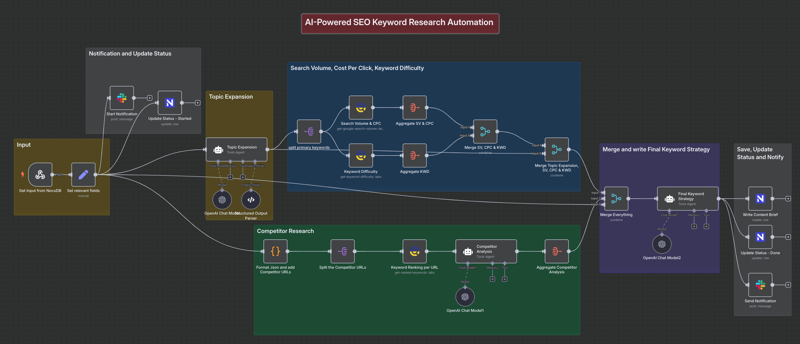
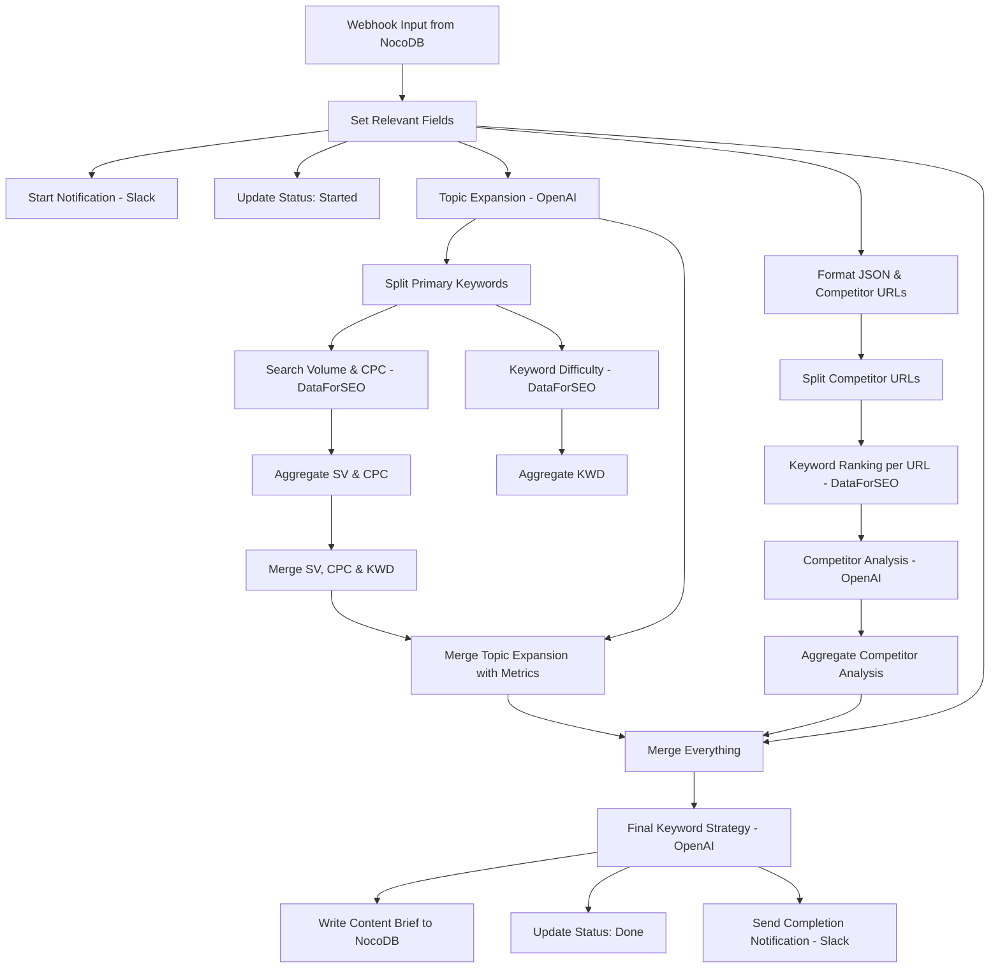
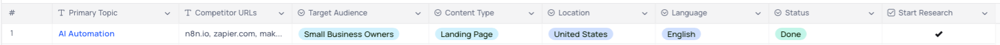
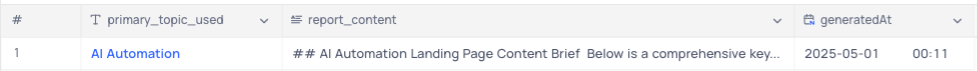
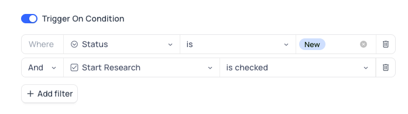
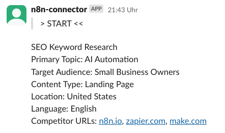
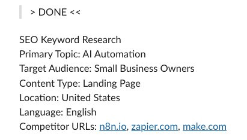

# AI-Powered SEO Keyword Research Workflow with n8n

This README provides a detailed explanation of the n8n workflow "AI powered SEO keyword research - vibe marketer", which automates comprehensive keyword research for content creation.

## Table of Contents

1. [Introduction](#introduction)
2. [Workflow Architecture](#workflow-architecture)
3. [NocoDB Integration](#nocodb-integration)
4. [Data Flow](#data-flow)
5. [Core Components](#core-components)
6. [Setup Requirements](#setup-requirements)
7. [Possible Improvements](#possible-improvements)

## Introduction

This n8n workflow automates SEO keyword research using AI and data-driven analytics. It combines OpenAI's language models with DataForSEO's analytics to generate comprehensive keyword strategies for content creation. The workflow is triggered by a webhook from NocoDB, processes the input data through multiple stages, and returns a detailed content brief with optimized keywords.

## Workflow Architecture

The workflow follows a structured process:

1. **Input Collection**: Receives data via webhook from NocoDB
2. **Topic Expansion**: Generates keywords using AI
3. **Keyword Metrics Analysis**: Gathers search volume, CPC, and difficulty metrics
4. **Competitor Analysis**: Analyzes competitor content for ranking keywords
5. **Final Strategy Creation**: Combines all data to generate a comprehensive keyword strategy
6. **Output Storage**: Saves results back to NocoDB and sends notifications

## NocoDB Integration

### Database Structure

The workflow integrates with two tables in NocoDB:

#### Input Table Schema

This table collects the input parameters for the keyword research:

| Field Name      | Type          | Description                                                                 |
| --------------- | ------------- | --------------------------------------------------------------------------- |
| ID              | Auto Number   | Unique identifier                                                           |
| Primary Topic   | Text          | The main keyword/topic to research                                          |
| Competitor URLs | Text          | Comma-separated list of competitor websites                                 |
| Target Audience | Single Select | Description of the target audience (Solopreneurs, Marketing Managers, etc.) |
| Content Type    | Single Select | Type of content (Blog, Product page, etc.)                                  |
| Location        | Single Select | Target geographic location                                                  |
| Language        | Single Select | Target language for keywords                                                |
| Status          | Single Select | Workflow status (Pending, Started, Done)                                    |
| Start Research  | Checkbox      | Active Workflow when you set this to true                                   |

#### Output Table Schema

This table stores the generated keyword strategy:

| Field Name         | Type        | Description                                      |
| ------------------ | ----------- | ------------------------------------------------ |
| ID                 | Auto Number | Unique identifier                                |
| primary_topic_used | Text        | The topic that was researched                    |
| report_content     | Long Text   | The complete keyword strategy in Markdown format |
| generatedAt        | Datetime    | Automatically generated by NocoDb                |

### Webhook Settings

NocoDB Webhook Settings

## Data Flow

The workflow handles data in the following sequence:

1. **Webhook Trigger**: Receives input from NocoDB when a new keyword research request is created
   
2. **Field Extraction**: Extracts primary topic, competitor URLs, audience, and other parameters
3. **AI Topic Expansion**: Uses OpenAI to generate related keywords, categorized by type and intent
4. **Keyword Analysis**: Sends primary keywords to DataForSEO to get search volume, CPC, and difficulty
5. **Competitor Research**: Analyzes competitor pages to identify their keyword rankings
6. **Strategy Generation**: Combines all data to create a comprehensive keyword strategy
7. **Storage & Notification**: Saves the strategy to NocoDB and sends a notification to Slack
   

## Core Components

### 1. Topic Expansion

This component uses OpenAI and a structured output parser to generate:

- 20 primary keywords
- 30 long-tail keywords with search intent
- 15 question-based keywords
- 10 related topics

### 2. DataForSEO Integration

Two API endpoints are used:

- **Search Volume & CPC**: Gets monthly search volume and cost-per-click data
- **Keyword Difficulty**: Evaluates how difficult it would be to rank for each keyword

### 3. Competitor Analysis

This component:

- Analyzes competitor URLs to identify which keywords they rank for
- Identifies content gaps or opportunities
- Determines the search intent their content targets

### 4. Final Keyword Strategy

The AI-generated strategy includes:

- Top 10 primary keywords with metrics
- 15 long-tail opportunities with low competition
- 5 question-based keywords to address in content
- Content structure recommendations
- 3 potential content titles optimized for SEO

## Setup Requirements

To use this workflow, you'll need:

1. **n8n Instance**: Either cloud or self-hosted
2. **NocoDB Account**: For data input and storage
3. **API Keys**:
   - OpenAI API key
   - DataForSEO API credentials
   - Slack API token (for notifications)
4. **Database Setup**: Create the required tables in NocoDB as described above

## Possible Improvements

The workflow could be enhanced with the following improvements:

### Enhanced Keyword Strategy

- Add topic clustering to group related keywords
- Enhance the final output with more specific content structure suggestions
- Include word count recommendations for each content section

### Additional Data Sources

- Integrate Google Search Console data for existing content optimization
- Add Google Trends data to identify rising topics
- Include sentiment analysis for different keyword groups

### Improved Competitor Analysis

- Analyze content length and structure from top-ranking pages
- Identify common backlink sources for competitor content
- Extract content headings to better understand content organization

### Automation Enhancements

- Add scheduling capabilities to run updates on existing content
- Implement content performance tracking over time
- Create alert thresholds for changes in keyword difficulty or search volume

---

## Example Output

Here is an example Output the Workflow generated based on the following inputs:

- Primary Topic: `AI Automation`
- Competitor URLs: `n8n.io, zapier.com, make.com`
- Target Audience: `Small Business Owners`
- Content Type: `Landing Page`
- Location: `United States`
- Language: `English`

**Output**: [Final Keyword Strategy ](./Final_Keyword_Strategy-AI_Automation.md)

---

The workflow provides a powerful automation for content marketers and SEO specialists to develop data-driven keyword strategies with minimal manual effort.

> Original Workflow: [AI-Powered SEO Keyword Research Automation - The vibe Marketer](https://templates.thevibemarketer.com/template/seo-keyword-research)

---

## Getting Started with n8n

This workflow is now available in the n8n template library as a verified creator workflow: [Comprehensive SEO Keyword Research with OpenAI & DataForSEO Analytics to NocoDB](https://n8n.io/workflows/3908-comprehensive-seo-keyword-research-with-openai-and-dataforseo-analytics-to-nocodb/)

If you're new to n8n, you can sign up and test this workflow directly:
[Get started with n8n](https://n8n.partnerlinks.io/d25fz3175b1l)
