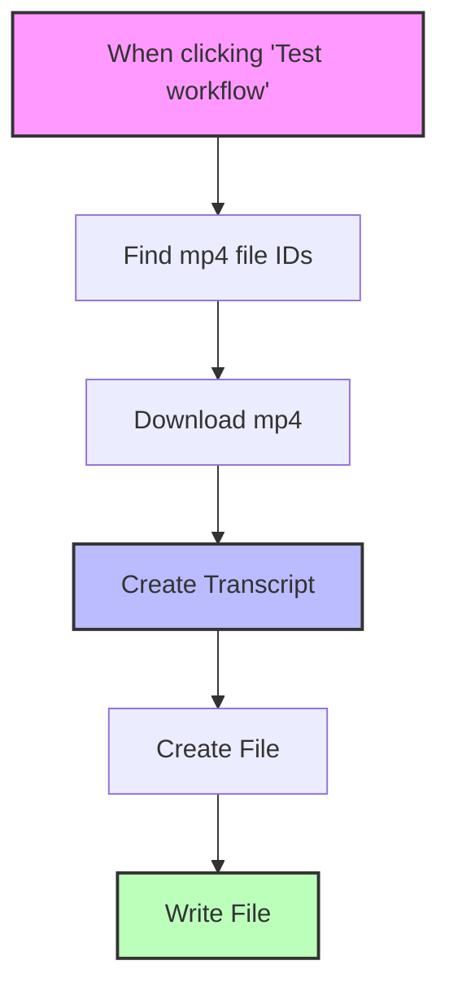

# Video to Text with ElevenLabs

This n8n workflow automatically transcribes MP4 videos from Google Drive using ElevenLabs' speech-to-text API and saves the transcriptions as Google Docs.

## Prerequisites

- n8n instance
- Google Drive account credentials
- Google Docs account credentials
- ElevenLabs API key

## Setup

1. Import the workflow JSON file into n8n
2. Configure credentials:
   - Connect Google Drive account
   - Connect Google Docs account
   - Create an ElevenLabs API key credential
3. In the "Find mp4 file IDs" node, replace 'PARENT FOLDER ID' with your actual Google Drive folder ID containing the videos
4. Optionally, adjust the folder ID in the "Create File" node where transcripts will be stored

## How It Works

1. **Trigger**: Workflow starts manually when clicking "Test workflow"
2. **Find Videos**: Searches for MP4 files in the specified Google Drive folder (limited to 10 files)
3. **Download**: Downloads each MP4 file
4. **Transcribe**: Sends the video to ElevenLabs API for transcription
5. **Create Document**: Creates a new Google Doc with naming format "Transcript-[filename]"
6. **Write Content**: Inserts the transcription text into the Google Doc

## Workflow Diagram

## Notes

- Files are processed sequentially
- Transcription quality depends on ElevenLabs' speech recognition capabilities
- The document title automatically removes the .mp4 extension from the original filename
